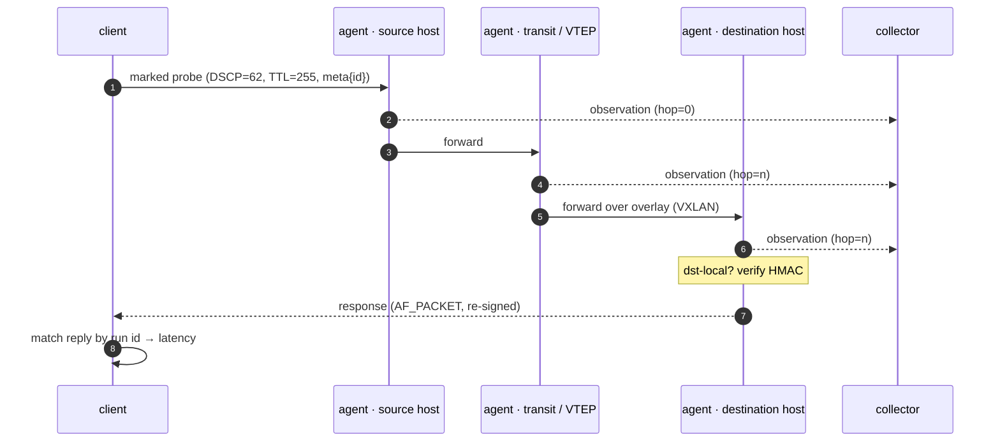
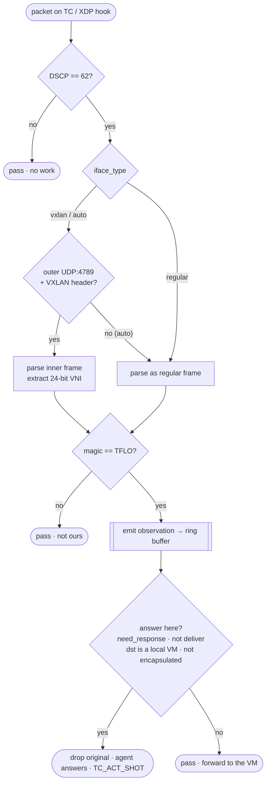

# Traceflow

> 🇷🇺 Документация на русском: **[README.md](README.md)**

**eBPF path diagnostics for OVN overlay networks.**

Traceflow answers one question that ordinary tooling cannot: *by which hosts, tunnels
and VNIs did this packet actually travel?* It sends a specially **marked** probe and
every hop on the way records that it saw it. It is like `traceroute`, but instead of
seeing only IP routers it sees the hypervisor data plane — tap ports, OVS bridges,
VXLAN tunnels and the VNI the frame rode in — across availability zones.

The mark is invisible to normal traffic and cheap to reject: an eBPF program on each
interface throws away 99.99% of packets in a single instruction and only looks closely
at the ones that carry the mark.

---

## Table of contents

- [How it works](#how-it-works)
- [The mark: two-level filtering](#the-mark-two-level-filtering)
- [The control block (`traceflow_meta`)](#the-control-block-traceflow_meta)
- [What the eBPF program does](#what-the-ebpf-program-does)
- [Observation model — tap vs VXLAN](#observation-model--tap-vs-vxlan)
- [What each observation records](#what-each-observation-records)
- [Components](#components)
- [The agent](#the-agent)
- [The client](#the-client)
- [The collector](#the-collector)
- [OTLP export (distributed tracing)](#otlp-export-distributed-tracing)
- [Authentication (HMAC)](#authentication-hmac)
- [Build](#build)
- [Container](#container)
- [Tests](#tests)
- [Two-AZ VXLAN lab](#two-az-vxlan-lab)
- [OVS-DPDK / AF_XDP](#ovs-dpdk--af_xdp)
- [Notes & limitations](#notes--limitations)

---

## How it works

Three cooperating parts: a **client** injects the probe, an **agent** on every
hypervisor observes (and, on the destination host, answers) it, and a **collector**
groups the per-hop records by run id and reconstructs the path.

```
 client                     hypervisor A                  hypervisor B
 ┌─────────┐   marked pkt   ┌────────────┐    overlay     ┌────────────┐
 │  client │ ──────────────▶│ agent+eBPF │ ──────────────▶│ agent+eBPF │
 └────┬────┘  DSCP62+magic  │  TC / XDP  │   VXLAN / tap  │  TC / XDP  │
      │ ▲                   └─────┬──────┘                └─────┬──────┘
      │ │ response                │  observations (ring buffer)  │
      │ │ (dst only)              ▼                              ▼
      │ └───────────────────  collector  ◀──── HTTP / OTLP ──────┘
      └─────────────────────▶ (group by run id → path)
```

The whole flow, end to end:



---

## The mark: two-level filtering

A probe is recognised in two stages, cheapest first.

| Level | Check | Why |
|-------|-------|-----|
| **L1** | `DSCP=62` (ToS byte `0xF8` in the IP header) | One instruction on the hot path. Virtually all traffic has a different DSCP and is dropped instantly, without the payload ever being read. |
| **L2** | magic `0x54464C4F` (`"TFLO"`) in the payload | DSCP=62 alone is not unique; the magic word confirms the packet is genuinely ours. |

The sender also fixes **`TTL=255`** (hop limit for IPv6), so every hop can compute
`hop = 255 - TTL` without any shared state. Pure L2 switching does not touch the TTL,
so several observations on the same L3 hop share one `hop` value but differ by
`node_id` — that is how a single logical hop that crosses two hypervisors is told
apart. Optionally an **HMAC** authenticates the mark (see [Authentication](#authentication-hmac)).

---

## The control block (`traceflow_meta`)

Immediately after the transport header (ICMP / UDP / TCP) the probe carries a 30-byte
control block. With `--hmac-key` a 32-byte HMAC-SHA256 is appended, making the payload
62 bytes.

```
 offset  0        4                          20   21   22              30              62
         ┌────────┬──────────────────────────┬────┬────┬───────────────┬──── HMAC ─────┐
         │ magic  │ id  (UUIDv4, 16 bytes)    │ in │ nr │  timestamp    │  SHA-256, 32B │
         │  4 B   │                           │ 1B │ 1B │   8 B (ns)    │  (optional)   │
         └────────┴──────────────────────────┴────┴────┴───────────────┴───────────────┘
           TFLO      run id, shared by all hops   │    │   send time
                                          deliver ┘    └ need_response
```

| Field | Size | Meaning |
|-------|------|---------|
| `magic` | 4 | `0x54464C4F` (`"TFLO"`), network byte order |
| `id` | 16 | UUIDv4 — the run identifier, shared by every hop |
| `deliver` | 1 | `0` (default) = agent intercepts at the destination; `1` = deliver the original to the VM |
| `need_response` | 1 | `1` = the destination should reply |
| `timestamp` | 8 | send time, unix nanoseconds (little-endian) — used for latency |

---

## What the eBPF program does

The same two-level filter and parsers run on either the **TC** hook (default,
ingress + egress) or the **XDP** hook (`--xdp`, ingress only). Per packet:



The parsers handle IPv4 and IPv6 (bounded extension-header walk), 802.1Q / 802.1AD
VLAN tags (including hardware offload via `skb->vlan_tci`), and VXLAN over an IPv4 or
IPv6 underlay. Records go to a 1 MiB ring buffer; a per-CPU stats map counts observed
packets and ring-buffer-full drops.

---

## Observation model — tap vs VXLAN

The two attach points mirror a real OVN/OVS deployment: inside an AZ the agent sits on
the VM **tap**, between AZs it sits on the **underlay / VXLAN netdev**.

```
  intra-AZ (tap model)                          inter-AZ (VXLAN)
  agent on the VM tap                           agent on the underlay / vxlan netdev

  VM ──tap──▶ [eBPF] ──▶ OVS ──▶ ...    ...  ──▶ [eBPF] ──▶ VXLAN ──▶ other AZ
       inner frame, DSCP+magic visible               outer Eth/IP/UDP/VXLAN + inner
       iface_type = REGULAR                          iface_type = VXLAN, VNI from wire
```

There are three ways the VNI is (or is not) on the wire, and the agent covers all of
them:

- **Regular / tap** (`iface_type=regular`) — the inner tenant frame
  `[Eth][VLAN?][IPv4/IPv6][L4][meta]`, seen before encapsulation or after
  decapsulation. No VNI in the bytes.
- **VXLAN underlay** (`iface_type=vxlan`) — the agent skips the outer
  `Eth/IP/UDP:4789/VXLAN`, reads the 24-bit VNI straight off the wire, and parses the
  inner frame. The outer header may be IPv4 or IPv6.
- **VXLAN netdev** (per-tenant device) — the kernel has already decapsulated, so the
  eBPF sees an inner frame with no VNI in the bytes. The netlink watcher reads the
  device's VNI (`Vxlan.VxlanId`) into a map keyed by `ifindex`, and the eBPF tags the
  observation by `skb->ifindex`. `collect_metadata` (per-packet VNI) devices are
  covered via `bpf_skb_get_tunnel_key`.
- **`auto`** (the default) — try VXLAN first on every packet, fall back to a regular
  frame. The reported `iface_type` is always the detected one, never `auto`.

**Interception is scoped to the destination.** By default the agent drops the original
probe once it reaches the destination VM and answers on its behalf, so the VM's own stack
does not reply too. The kernel drops it only when it will answer — `need_response` is set,
the inner `dst_ip` is a local VM (so transit and source hops never drop), the frame is not
VXLAN-encapsulated, and this agent responds. A probe sent with `--deliver` is passed
through to the VM instead, and the agent stays silent.

---

## What each observation records

Every marked packet becomes one observation. Emitted as JSON by the agent (and shipped
to the collector / OTLP):

```json
{
  "id": "3f2b1c9e-8a7d-4e6f-b012-9c8d7e6f5a4b",
  "node_id": "hv-07",
  "hop": 1,
  "direction": "INGRESS",
  "vni": 100,
  "vlan": 42,
  "action": "FORWARDED",
  "protocol": "TCP",
  "ip_version": 4,
  "ifindex": 7,
  "iface": "tap0abc",
  "logical_switch": "ls-tenant-a",
  "az": "az-east-1",
  "src_ip": "10.10.0.1",
  "dst_ip": "10.10.0.2",
  "src_port": 40000,
  "dst_port": 80,
  "tcp_flags": "SYN|ACK",
  "iface_type": "VXLAN",
  "timestamp": "2026-08-19T12:00:00.123456789Z",
  "capture_ns": 51230948120,
  "latency_ns": 351200
}
```

| Field | Source | Meaning |
|-------|--------|---------|
| `id` | packet | run UUID; the join key across all hops |
| `node_id` | agent | which host emitted the record (`--node-id`, default hostname) |
| `hop` | packet | `255 - TTL`; shared by observations on the same L3 hop |
| `direction` | kernel | `INGRESS` / `EGRESS` (TC hook side) |
| `vni` | wire / device | VXLAN VNI (`0` when not VXLAN) |
| `vlan` | wire / offload | 802.1Q VID (omitted when untagged) |
| `action` | eBPF | `FORWARDED` / `INTERCEPTED` |
| `protocol` | packet | `ICMP` / `ICMPv6` / `TCP` / `UDP` |
| `ip_version` | packet | `4` or `6` |
| `ifindex`, `iface` | kernel | interface index and resolved name |
| `logical_switch` | agent | OVN logical switch for the VNI (best-effort) |
| `az` | agent | availability zone (`--az`) |
| `src_ip`, `dst_ip` | packet | inner addresses |
| `src_port`, `dst_port` | packet | for TCP/UDP |
| `tcp_flags` | packet | e.g. `SYN\|ACK` (TCP only) |
| `iface_type` | eBPF | `REGULAR` or `VXLAN` |
| `timestamp` | agent | capture wall-clock (RFC 3339) |
| `capture_ns` | kernel | monotonic capture time (`bpf_ktime_get_ns`) |
| `latency_ns` | agent | `now − meta.timestamp`, clamped to ≥ 0 |
| `clock_skew` | agent | `true` when the raw delta was negative (hosts out of sync) |

---

## Components

```
bpf/traceflow.c        eBPF program: 2-level filter, VXLAN, VLAN, IPv6, ring buffer
bpf/traceflow.h        structs shared between eBPF and Go (kept byte-for-byte in sync)
internal/tfmeta        meta constants, (de)serialisation and HMAC of traceflow_meta
internal/pkt           packet builders: Eth/IP{4,6}/ICMP{,v6}/UDP/TCP/VXLAN + checksums
internal/observation   ring-buffer decode → enriched JSON record
internal/ovs           OVS/OVN discovery (ovs-vsctl / ovn-nbctl / ovn-sbctl) + parsers
agent/                 eBPF loader, ring reader, responder, watchers, metrics, emitters
client/                marked-probe sender + AF_PACKET reply sniffer
collector/             HTTP collector: group observations by run id, assemble paths
scripts/               demo-netns.sh, lab-2az-vxlan.sh
tests/                 Go unit tests + integration suite (netns / VXLAN / OVN)
```

---

## The agent

One agent per hypervisor. On startup it:

1. loads the eBPF program via `cilium/ebpf` (pure Go, no CGO);
2. writes the config map (`iface_type`, `respond`, `tcp_respond`) and the local-VM-IP set;
3. attaches the observation program;
4. reads observations from the ring buffer and prints JSON (or ships them onward);
5. **answers only for the destination VM.**

**Attach.** The default is the **TC** hook (ingress + egress): **TCX** on kernel ≥ 6.6,
with an automatic fallback to classic **clsact + cls_bpf** over netlink (down to ~4.5).
With `--xdp` it attaches at the **XDP** hook instead (ingress only) — see
[OVS-DPDK / AF_XDP](#ovs-dpdk--af_xdp).

**Responding.** Observations are captured on *every* hop, but a reply to
`need_response=1` is built only when the inner `dst_ip` is a local VM address
(`--local-ip`, or resolved by the watcher). Transit and VTEP nodes are observe-only.
By default the agent also **intercepts** the original at the destination (the eBPF drops
it) so the VM's own stack does not answer too; a probe sent with `--deliver` is passed
through to the VM, which then replies itself. Replies leave via **AF_PACKET** (an L2 raw
socket), bypassing the kernel routing stack; the address swap reuses the VM's own MAC/IP,
which is exactly what OVN port security expects. TCP is answered by a small,
sequence-correct userspace responder (`--tcp-respond=false` lets the real VM stack answer
instead). The AF_PACKET responder taps ingress before the TC hook, so it still sees and
answers a probe even though the original is dropped.

**Watch modes (dynamic attach).**

- `--watch` — discovers OVN VM taps via `ovs-vsctl` (`external_ids:iface-id`),
  attaches/detaches eBPF as VMs come and go, and resolves each VM's IPs from the OVN
  NB DB (`ovn-nbctl`, best-effort) so the responder answers automatically.
- `--watch-vxlan` — follows per-tenant VXLAN netdevs via **netlink** link events
  (created/removed by OVN or any controller) and tags observations with the device VNI.

**Key flags.**

| Flag | Default | Meaning |
|------|---------|---------|
| `--iface NAME` | — | attach to a single interface (static mode) |
| `--iface-type` | `auto` | `auto` \| `regular` \| `vxlan` |
| `--node-id` | hostname | identifier stamped on every observation |
| `--respond` | `true` | reply to `need_response=1` for local VM IPs |
| `--tcp-respond` | `true` | answer TCP in userspace; `false` defers to the VM stack |
| `--local-ip` | — | comma-separated local VM IPs (static mode) |
| `--watch` / `--watch-vxlan` | `false` | dynamic attach (see above) |
| `--hmac-key` | — | shared secret; responder rejects invalid/absent HMAC |
| `--az` | — | availability zone tagged onto observations |
| `--metrics-addr` | — | `host:port` for Prometheus `/metrics` + `/healthz` |
| `--collector-url` | — | POST each observation as JSON to this URL |
| `--otlp-endpoint` | — | export each observation as an OTLP span |
| `--xdp` | `false` | attach at XDP instead of TC |

---

## The client

The probe sender. Every probe carries `DSCP=62`, `TTL=255` and a `traceflow_meta`
block so agents observe it.

| Command | What it sends |
|---------|---------------|
| `icmp` | ICMP / ICMPv6 echo request (`--response` waits for the echo reply) |
| `udp` | UDP datagram (`--response` waits for a UDP reply) |
| `htcp` | TCP handshake only: SYN → SYN/ACK → ACK |
| `tcp` | full TCP dialog: handshake + data + FIN |
| `vxlan` | VXLAN-encapsulated marked ICMP with a given VNI |

IPv4 without a VLAN is sent through an AF_INET raw socket (`IP_HDRINCL`) and the kernel
routes it. IPv6 or a VLAN tag needs L2 framing, so the probe goes out via AF_PACKET
(`--iface` + `--dst-mac`, optional `--vlan`). `--as-vm` fills the source IP/MAC from
the OVS tap so OVN port security accepts the injected frame. `--hmac-key` signs the
probe. By default the destination agent intercepts the probe and answers it; add
`--deliver` to let the probe reach the VM so its own stack replies. Replies are caught
with an AF_PACKET sniffer and matched by run id.

```bash
# ICMP echo across the overlay, wait for the reply
sudo bin/client icmp --dst 10.10.0.2 --response

# Full TCP dialog to port 80, signed
sudo bin/client tcp --dst 10.10.0.2 --dport 80 --hmac-key s3cret --response

# Handshake only
sudo bin/client htcp --dst 10.10.0.2 --dport 80

# Inject as the VM (OVN port security) over its tap, VLAN 42
sudo bin/client icmp --dst 10.10.0.2 --iface tap0abc --dst-mac 02:00:00:00:00:01 \
    --vlan 42 --as-vm --response

# VXLAN-encapsulated probe with an explicit VNI
sudo bin/client vxlan --dst 192.0.2.9 --inner-src 10.0.0.1 --inner-dst 10.0.0.2 --vni 100
```

---

## The collector

`collector` ingests observations over HTTP and groups them by run `id` — a key that is
stable even where NAT rewrites the 5-tuple, so a path across SNAT/DNAT is assembled as
one flow. Agents ship to it with `--collector-url`.

```
POST /                one observation as JSON (what the agent ships)   → 204
GET  /paths           list run ids with observation counts
GET  /path?id=<uuid>  the run's observations, ordered by hop then time
GET  /healthz
```

Flags: `--addr` (default `:8080`), `--max-runs` (default `10000`, LRU-evicted). Storage
is in-memory — the collector is a reference sink; for production, point `--collector-url`
at your own ingester or use OTLP.

---

## OTLP export (distributed tracing)

A traced path maps 1:1 onto tracing spans, so the agent can export straight to any
OpenTelemetry backend (Tempo, Jaeger, …) — no bespoke UI required:

```bash
sudo bin/agent --watch --az az-1 --otlp-endpoint otel-collector:4318
```

Each observation becomes a **span**; the run UUID **is** the 128-bit **trace id** (so
every host's observations land in one trace); fields become attributes
(`traceflow.node_id/az/hop/vni/direction/…`, `source.address`, `destination.address`).
The spans of a run share a synthetic parent derived from the UUID and are ordered by the
`hop` attribute — a network path is not a call tree, so they are correlated by trace id
+ hop, not by causal nesting. Transport is OTLP/HTTP (a protobuf POST to
`<endpoint>/v1/traces`, insecure by default).

---

## Authentication (HMAC)

`DSCP=62 + magic` is trivially spoofable. `--hmac-key <secret>` enables an HMAC-SHA256
over the 30-byte meta core. The **responder verifies it and never replies without a
valid HMAC** (counted as `traceflow_auth_failures_total`), which shuts down
amplification and unauthenticated probing. Echo replies are re-signed so the return
path stays valid.

eBPF cannot compute an HMAC cheaply on the hot path, so *observations* remain advisory
(anyone who knows the DSCP and magic can make a packet be observed); enforcement lives
at the responder, which is the only component that emits traffic in response.

---

## Build

```bash
sudo apt install -y clang llvm libbpf-dev linux-libc-dev make golang
make deps        # go mod tidy
make generate    # bpf2go: bpf/traceflow.c → agent/traceflow_bpf*.go
make build       # → bin/{agent,client,collector}
```

Runtime: Linux (TCX needs ≥ 6.6; older kernels use the clsact fallback), run as root or
with `CAP_BPF` + `CAP_NET_ADMIN` + `CAP_NET_RAW`.

Make targets: `deps`, `generate`, `build`, `agent`, `client`, `collector`, `test`,
`itest`, `image`, `image-itest`, `images`, `images-push`, `clean`.

---

## Container

```bash
make image                                   # unit tests run in the builder stage
podman run --rm --privileged traceflow itest # integration suite (rootful for real BPF)
```

Rootless podman can build the image and run the unit tests, but loading eBPF and
`ip netns exec` need real BPF/net capabilities — the integration tests SKIP (they do not
fail) when those are unavailable. Run rootful, or on the host.

---

## Release images

Each component ships as its own minimal image, built from `deploy/docker/Dockerfile`
(a shared cross-compiling builder stage + one lean final stage per component):

| Image | Base | Purpose |
|-------|------|---------|
| `traceflow-agent` | debian-slim + iproute2 | loads eBPF, answers/intercepts probes (privileged) |
| `traceflow-client` | debian-slim | injects marked probes |
| `traceflow-collector` | distroless static (nonroot) | HTTP path aggregator |

Build locally (single-arch, loaded into the engine):

```bash
make images                      # all three, tagged :dev
make image-agent VERSION=v1.4.0  # just one
```

Pushing a `vX.Y.Z` tag runs `.github/workflows/release.yml`, which builds each image
**multi-arch (`linux/amd64` + `linux/arm64`)** and pushes to GHCR, then cuts a GitHub
Release with auto notes and static binary tarballs:

```bash
git tag v1.4.0 && git push origin v1.4.0
```

```bash
# tagged :X.Y.Z, :X.Y, and (for non-prerelease tags) :latest
docker pull ghcr.io/slepwin/traceflow-agent:v1.4.0
docker pull ghcr.io/slepwin/traceflow-client:v1.4.0
docker pull ghcr.io/slepwin/traceflow-collector:v1.4.0
```

`ci.yml` runs the unit tests and builds all three images (no push) on every PR, so the
release path is validated before a tag is ever cut.

---

## Tests

```bash
make test    # Go unit tests (no root)
make itest   # integration suite (needs root; see below)
```

Each integration test SKIPs cleanly when its prerequisites are missing:

| Test | What it exercises |
|------|-------------------|
| `test_veth_multinetns.sh` | routed `ns1 — ns2(router) — ns3`: hop 0/1 across an L3 router, run-id correlation, dst-VM responder |
| `test_vxlan.sh` | VXLAN underlay parse (VNI, structural intercept guard) |
| `test_ipv6_vlan.sh` | ICMPv6 and 802.1Q VLAN observation |
| `test_watch_vxlan.sh` | netlink VXLAN watcher: attach existing, dynamic create/delete, device-VNI enrichment |
| `test_hmac.sh` | signed probe answered, unsigned rejected (checked via metrics) |
| `test_clsact.sh` | the clsact/cls_bpf fallback (`TRACEFLOW_FORCE_CLSACT=1`) |
| `test_xdp.sh` | the XDP attach path (`--xdp`): program on the netdev, ingress observation |
| `test_vxlan_2az.sh` | two chassis / two AZs joined by VXLAN (needs OVS) |

---

## Two-AZ VXLAN lab

Two OVN-style chassis in two AZs, joined by VXLAN: the inter-netns underlay is built from
**OVS internal ports** (real kernel netdevs), and the inter-AZ overlay is a **kernel VXLAN
device**.

```
 host: OVS br-underlay  (normal L2 switch)
          ula ── moved into ns az1        ulb ── moved into ns az2
 ┌──────────────── ns az1 (AZ1) ────────┐   ┌──────────── ns az2 (AZ2) ─────────┐
 │  ula   172.16.9.1/24  (underlay)      │   │  ulb   172.16.9.2/24              │
 │  vxlan0 id100 remote .2 ── VXLAN(100) ┼───┼── vxlan0 id100 remote .1          │
 │    10.0.0.1/24  (VM-A)                │   │    10.0.0.2/24  (VM-B)            │
 └───────────────────────────────────────┘   └───────────────────────────────────┘

 A marked ICMP VM-A → VM-B is observed at three points, one run id:
   (1) VM-A overlay netdev  (device vni=100)
   (2) inter-AZ VXLAN leg on the underlay  (packet vni=100, outer Eth/IP/UDP/VXLAN)
   (3) VM-B overlay netdev  (device vni=100)
```

```bash
sudo ovs-ctl start
sudo ./scripts/lab-2az-vxlan.sh up
sudo ./scripts/lab-2az-vxlan.sh agents &
sudo ./scripts/lab-2az-vxlan.sh probe
sudo ./scripts/lab-2az-vxlan.sh down
```

*Why internal ports:* an OVS internal port is a real kernel netdev that stays attached
to the OVS datapath even after being moved into a netns, so two netns "chassis" are
wired together through the host datapath. (`ovs-sandbox` / `make sandbox`
uses the **dummy** datapath, where no real packets flow through kernel netdevs, so
eBPF/TC cannot observe them — a real kernel datapath is required.)

---

## OVS-DPDK / AF_XDP

With OVS-DPDK the datapath runs in userspace, so the TC path can miss traffic:

- **OVS with `type=afxdp` netdevs** — the NIC stays a kernel netdev, but OVS loads an
  XDP program that `XDP_REDIRECT`s frames to an AF_XDP socket *before* the TC hook, so a
  TC program never sees them. `--xdp` attaches the same two-level filter and parsers at
  the **XDP hook** (which runs first), emits the same observations, and returns
  `XDP_PASS` so OVS still gets the frame. It prefers native (driver) mode and falls back
  to generic (SKB) mode.

  ```bash
  sudo bin/agent --xdp --iface eth0 --node-id hv-01
  ```

  Caveat: only one XDP program can own a netdev unless an `xdp-dispatcher` (libxdp) is
  used; on a NIC that already runs OVS's XDP program, chaining via libxdp is required.
  XDP here is ingress-only.

- **OVS-DPDK with a DPDK PMD (vfio-pci)** — the NIC is fully owned by the userspace DPDK
  driver, so there is **no kernel netdev** and neither TC nor XDP can attach. Observation
  there needs an OVS mirror port / native OVS tracing; that is out of scope.

- **vhost-user VM ports** — the VM connects over a unix socket + shared memory, with no
  netdev, so eBPF cannot observe at the port regardless.

---

## Notes & limitations

- **HMAC** is enforced at the responder; observations are advisory (eBPF does not
  compute HMAC on the hot path).
- **Latency across hosts** needs tight time sync (PTP). The value is clamped to ≥ 0 and
  flagged `clock_skew` when the hosts disagree.
- **IPv6** extension headers are walked with a bounded loop; a non-first fragment carries
  no transport header and is not marked.
- **Portability**: TCX (≥ 6.6) with a clsact/cls_bpf netlink fallback; the program
  touches only stable UAPI (`__sk_buff` + packet bytes), so no CO-RE is needed.
- The bundled **collector** is an in-memory reference sink — swap in your own ingester,
  or use OTLP, for production retention.
