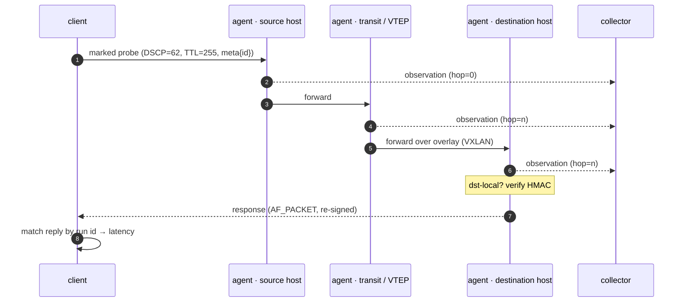
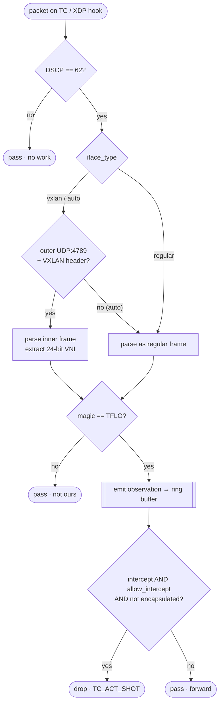

# Traceflow

> 🇬🇧 English documentation: **[README.en.md](README.en.md)**

**Диагностика сетевого пути для overlay-сетей (VXLAN) на базе eBPF.**

Traceflow отвечает на вопрос, недоступный обычным инструментам: *через какие именно
хосты, туннели и VNI прошёл этот пакет?* Он отправляет специально **маркированный**
пробный пакет, и каждый хоп по пути фиксирует, что видел его. Это как `traceroute`, но
вместо одних лишь IP-маршрутизаторов он видит data plane гипервизора — tap-порты,
OVS-мосты, VXLAN-туннели и VNI, в котором ехал кадр, — в том числе между зонами
доступности.

Метка невидима для обычного трафика и дёшево отбрасывается: eBPF-программа на каждом
интерфейсе отсеивает 99.99% пакетов одной инструкцией и внимательно смотрит только на
те, что несут метку.

---

## Оглавление

- [Как это работает](#как-это-работает)
- [Метка: двухуровневая фильтрация](#метка-двухуровневая-фильтрация)
- [Управляющий блок (`traceflow_meta`)](#управляющий-блок-traceflow_meta)
- [Что делает eBPF-программа](#что-делает-ebpf-программа)
- [Модель наблюдения — tap vs VXLAN](#модель-наблюдения--tap-vs-vxlan)
- [Что фиксирует каждая observation](#что-фиксирует-каждая-observation)
- [Компоненты](#компоненты)
- [Агент](#агент)
- [Клиент](#клиент)
- [Коллектор](#коллектор)
- [OTLP-экспорт (distributed tracing)](#otlp-экспорт-distributed-tracing)
- [Аутентификация (HMAC)](#аутентификация-hmac)
- [Сборка](#сборка)
- [Контейнер](#контейнер)
- [Тесты](#тесты)
- [Стенд 2 AZ через VXLAN (без veth)](#стенд-2-az-через-vxlan-без-veth)
- [OVS-DPDK / AF_XDP](#ovs-dpdk--af_xdp)
- [Заметки и ограничения](#заметки-и-ограничения)

---

## Как это работает

Три взаимодействующие части: **клиент** внедряет пробу, **агент** на каждом
гипервизоре наблюдает её (а на хосте назначения — отвечает), а **коллектор** группирует
записи с каждого хопа по run id и восстанавливает путь.

```
 client                     hypervisor A                  hypervisor B
 ┌─────────┐   marked pkt   ┌────────────┐    overlay     ┌────────────┐
 │  client │ ──────────────▶│ agent+eBPF │ ──────────────▶│ agent+eBPF │
 └────┬────┘  DSCP62+magic  │  TC / XDP  │   VXLAN / tap  │  TC / XDP  │
      │ ▲                   └─────┬──────┘                └─────┬──────┘
      │ │ response                │  observations (ring buffer)  │
      │ │ (dst only)              ▼                              ▼
      │ └───────────────────  collector  ◀──── HTTP / OTLP ──────┘
      └─────────────────────▶ (group by run id → path)
```

Полный поток, от начала до конца:



---

## Метка: двухуровневая фильтрация

Проба распознаётся в два этапа, начиная с самого дешёвого.

| Уровень | Проверка | Зачем |
|---------|----------|-------|
| **L1** | `DSCP=62` (байт ToS `0xF8` в IP-заголовке) | Одна инструкция на горячем пути. Почти весь трафик имеет другой DSCP и отбрасывается мгновенно, payload при этом даже не читается. |
| **L2** | magic `0x54464C4F` (`"TFLO"`) в payload | Один лишь DSCP=62 не уникален; magic-слово подтверждает, что пакет действительно наш. |

Отправитель также фиксирует **`TTL=255`** (hop limit для IPv6), поэтому каждый хоп может
вычислить `hop = 255 - TTL` без какого-либо общего состояния. Чистая L2-коммутация
TTL не трогает, поэтому несколько observations на одном L3-хопе делят одно значение
`hop`, но отличаются `node_id` — именно так различаются два гипервизора внутри одного
логического хопа. Опционально метку аутентифицирует **HMAC** (см.
[Аутентификация](#аутентификация-hmac)).

---

## Управляющий блок (`traceflow_meta`)

Сразу за транспортным заголовком (ICMP / UDP / TCP) проба несёт 30-байтовый
управляющий блок. С `--hmac-key` к нему приписывается 32-байтовый HMAC-SHA256, и
payload становится 62 байта.

```
 offset  0        4                          20   21   22              30              62
         ┌────────┬──────────────────────────┬────┬────┬───────────────┬──── HMAC ─────┐
         │ magic  │ id  (UUIDv4, 16 bytes)    │ in │ nr │  timestamp    │  SHA-256, 32B │
         │  4 B   │                           │ 1B │ 1B │   8 B (ns)    │  (optional)   │
         └────────┴──────────────────────────┴────┴────┴───────────────┴───────────────┘
           TFLO      run id, shared by all hops   │    │   send time
                                        intercept ┘    └ need_response
```

| Поле | Размер | Значение |
|------|--------|----------|
| `magic` | 4 | `0x54464C4F` (`"TFLO"`), network byte order |
| `id` | 16 | UUIDv4 — идентификатор запуска, общий для всех хопов |
| `intercept` | 1 | `1` = попросить агенты перехватить (дропнуть) пакет |
| `need_response` | 1 | `1` = хост назначения должен ответить |
| `timestamp` | 8 | время отправки, unix-наносекунды (little-endian) — для latency |

---

## Что делает eBPF-программа

Один и тот же двухуровневый фильтр и парсеры работают либо на **TC**-хуке (по
умолчанию, ingress + egress), либо на **XDP**-хуке (`--xdp`, только ingress). Для
каждого пакета:



Парсеры обрабатывают IPv4 и IPv6 (ограниченный обход extension-заголовков), теги VLAN
802.1Q / 802.1AD (включая аппаратный offload через `skb->vlan_tci`) и VXLAN поверх
IPv4- или IPv6-underlay. Записи попадают в ring buffer на 1 MiB; per-CPU stats-map
считает наблюдённые пакеты и дропы из-за переполнения ring buffer.

---

## Модель наблюдения — tap vs VXLAN

Две точки attach отражают реальный деплой OVN/OVS: внутри AZ агент сидит на **tap** VM,
между AZ — на **underlay / VXLAN-netdev**.

```
  intra-AZ (tap model)                          inter-AZ (VXLAN)
  agent on the VM tap                           agent on the underlay / vxlan netdev

  VM ──tap──▶ [eBPF] ──▶ OVS ──▶ ...    ...  ──▶ [eBPF] ──▶ VXLAN ──▶ other AZ
       inner frame, DSCP+magic visible               outer Eth/IP/UDP/VXLAN + inner
       iface_type = REGULAR                          iface_type = VXLAN, VNI from wire
```

Есть три варианта того, как VNI присутствует (или отсутствует) на проводе, и агент
покрывает их все:

- **Regular / tap** (`iface_type=regular`) — внутренний (tenant) кадр
  `[Eth][VLAN?][IPv4/IPv6][L4][meta]`, наблюдаемый до инкапсуляции или после
  декапсуляции. VNI в байтах нет.
- **VXLAN underlay** (`iface_type=vxlan`) — агент пропускает внешний
  `Eth/IP/UDP:4789/VXLAN`, читает 24-битный VNI прямо с провода и парсит inner-кадр.
  Внешний заголовок может быть IPv4 или IPv6.
- **VXLAN netdev** (per-tenant устройство) — ядро уже декапсулировало, поэтому
  eBPF видит inner-кадр без VNI в байтах. Netlink-watcher читает VNI устройства
  (`Vxlan.VxlanId`) в map по ключу `ifindex`, а eBPF тегирует observation по
  `skb->ifindex`. Устройства `collect_metadata` (VNI per-packet) покрываются через
  `bpf_skb_get_tunnel_key`.
- **`auto`** (по умолчанию) — на каждый пакет сначала попытка VXLAN, откат на regular.
  В observation всегда указывается обнаруженный `iface_type`, никогда не `auto`.

**Два независимых safety-guard'а** означают, что пакет дропается, только если
`intercept` был запрошен **и** attach это разрешает (`--allow-intercept`) **и** — что
проверяется в ядре — пакет не VXLAN-инкапсулирован. Транзитный и туннельный трафик
поэтому *всегда только наблюдается*, никогда не дропается.

---

## Что фиксирует каждая observation

Каждый маркированный пакет становится одной observation. Агент выдаёт её как JSON (и
отправляет в коллектор / OTLP):

```json
{
  "id": "3f2b1c9e-8a7d-4e6f-b012-9c8d7e6f5a4b",
  "node_id": "hv-07",
  "hop": 1,
  "direction": "INGRESS",
  "vni": 100,
  "vlan": 42,
  "action": "FORWARDED",
  "protocol": "TCP",
  "ip_version": 4,
  "ifindex": 7,
  "iface": "tap0abc",
  "logical_switch": "ls-tenant-a",
  "az": "az-east-1",
  "src_ip": "10.10.0.1",
  "dst_ip": "10.10.0.2",
  "src_port": 40000,
  "dst_port": 80,
  "tcp_flags": "SYN|ACK",
  "iface_type": "VXLAN",
  "timestamp": "2026-08-19T12:00:00.123456789Z",
  "capture_ns": 51230948120,
  "latency_ns": 351200
}
```

| Поле | Источник | Значение |
|------|----------|----------|
| `id` | пакет | run UUID; ключ связывания всех хопов |
| `node_id` | агент | какой хост выдал запись (`--node-id`, по умолчанию hostname) |
| `hop` | пакет | `255 - TTL`; общий для observations на одном L3-хопе |
| `direction` | ядро | `INGRESS` / `EGRESS` (сторона TC-хука) |
| `vni` | провод / устройство | VXLAN VNI (`0`, когда не VXLAN) |
| `vlan` | провод / offload | 802.1Q VID (опускается, если без тега) |
| `action` | eBPF | `FORWARDED` / `INTERCEPTED` |
| `protocol` | пакет | `ICMP` / `ICMPv6` / `TCP` / `UDP` |
| `ip_version` | пакет | `4` или `6` |
| `ifindex`, `iface` | ядро | индекс интерфейса и разрешённое имя |
| `logical_switch` | агент | OVN logical switch для VNI (best-effort) |
| `az` | агент | зона доступности (`--az`) |
| `src_ip`, `dst_ip` | пакет | внутренние адреса |
| `src_port`, `dst_port` | пакет | для TCP/UDP |
| `tcp_flags` | пакет | напр. `SYN\|ACK` (только TCP) |
| `iface_type` | eBPF | `REGULAR` или `VXLAN` |
| `timestamp` | агент | wall-clock захвата (RFC 3339) |
| `capture_ns` | ядро | монотонное время захвата (`bpf_ktime_get_ns`) |
| `latency_ns` | агент | `now − meta.timestamp`, клампится в ≥ 0 |
| `clock_skew` | агент | `true`, когда сырая разница была отрицательной (часы хостов рассинхронизированы) |

---

## Компоненты

```
bpf/traceflow.c        eBPF program: 2-level filter, VXLAN, VLAN, IPv6, ring buffer
bpf/traceflow.h        structs shared between eBPF and Go (kept byte-for-byte in sync)
internal/tfmeta        meta constants, (de)serialisation and HMAC of traceflow_meta
internal/pkt           packet builders: Eth/IP{4,6}/ICMP{,v6}/UDP/TCP/VXLAN + checksums
internal/observation   ring-buffer decode → enriched JSON record
internal/ovs           OVS/OVN discovery (ovs-vsctl / ovn-nbctl / ovn-sbctl) + parsers
agent/                 eBPF loader, ring reader, responder, watchers, metrics, emitters
client/                marked-probe sender + AF_PACKET reply sniffer
collector/             HTTP collector: group observations by run id, assemble paths
scripts/               demo-netns.sh, lab-2az-vxlan.sh
tests/                 Go unit tests + integration suite (netns / veth / VXLAN / OVN)
```

---

## Агент

По одному агенту на гипервизор. При старте он:

1. грузит eBPF-программу через `cilium/ebpf` (pure Go, без CGO);
2. пишет config map (`allow_intercept`, `iface_type`);
3. прикрепляет observation-программу;
4. читает observations из ring buffer и печатает JSON (или отправляет дальше);
5. **отвечает только за VM назначения.**

**Attach.** По умолчанию — **TC**-хук (ingress + egress): **TCX** на ядре ≥ 6.6, с
автоматическим откатом на классический **clsact + cls_bpf** через netlink (примерно до
4.5). С `--xdp` прикрепляется к **XDP**-хуку (только ingress) — см.
[OVS-DPDK / AF_XDP](#ovs-dpdk--af_xdp).

**Ответы.** Observations снимаются на *каждом* хопе, но ответ на `need_response=1`
строится, только если внутренний `dst_ip` — локальный адрес VM (`--local-ip` или
резолвит watcher). Транзитные и VTEP-узлы работают в режиме observe-only. Ответы
уходят через **AF_PACKET** (L2 raw socket), минуя маршрутизацию ядра; разворот
адресов переиспользует MAC/IP самой VM — ровно то, что ожидает OVN port security. TCP
обслуживает маленький, seq-корректный userspace-responder (`--tcp-respond=false`
позволяет ответить реальному стеку VM).

**Watch-режимы (динамический attach).**

- `--watch` — находит OVN VM-tap'ы через `ovs-vsctl` (`external_ids:iface-id`),
  attach'ит/detach'ит eBPF по мере появления/исчезновения VM и резолвит IP каждой VM из
  OVN NB DB (`ovn-nbctl`, best-effort), так что responder отвечает автоматически.
- `--watch-vxlan` — следит за per-tenant VXLAN-netdev'ами через **netlink** link events
  (создаются/удаляются OVN или любым контроллером) и тегирует observations VNI устройства.

**Ключевые флаги.**

| Флаг | По умолчанию | Значение |
|------|--------------|----------|
| `--iface NAME` | — | attach к одному интерфейсу (статический режим) |
| `--iface-type` | `auto` | `auto` \| `regular` \| `vxlan` |
| `--allow-intercept` | `false` | разрешить дроп перехваченных пакетов (только plain-кадры) |
| `--node-id` | hostname | идентификатор в каждой observation |
| `--respond` | `true` | отвечать на `need_response=1` для локальных IP VM |
| `--tcp-respond` | `true` | отвечать на TCP в userspace; `false` отдаёт стеку VM |
| `--local-ip` | — | локальные IP VM через запятую (статический режим) |
| `--watch` / `--watch-vxlan` | `false` | динамический attach (см. выше) |
| `--hmac-key` | — | общий секрет; responder отклоняет невалидный/отсутствующий HMAC |
| `--az` | — | зона доступности, добавляемая в observations |
| `--metrics-addr` | — | `host:port` для Prometheus `/metrics` + `/healthz` |
| `--collector-url` | — | POST каждой observation как JSON на этот URL |
| `--otlp-endpoint` | — | экспорт каждой observation как OTLP-span |
| `--xdp` | `false` | attach на XDP вместо TC |

---

## Клиент

Отправитель проб. Каждая проба несёт `DSCP=62`, `TTL=255` и блок `traceflow_meta`, так
что агенты её наблюдают.

| Команда | Что отправляет |
|---------|----------------|
| `icmp` | ICMP / ICMPv6 echo request (`--response` ждёт echo reply) |
| `udp` | UDP-датаграмму (`--response` ждёт UDP-ответ) |
| `htcp` | только TCP handshake: SYN → SYN/ACK → ACK |
| `tcp` | полный TCP-диалог: handshake + data + FIN |
| `vxlan` | VXLAN-инкапсулированный маркированный ICMP с заданным VNI |

IPv4 без VLAN отправляется через AF_INET raw socket (`IP_HDRINCL`), и маршрутизирует
его ядро. IPv6 или тег VLAN требуют L2-кадра, поэтому проба уходит через AF_PACKET
(`--iface` + `--dst-mac`, опционально `--vlan`). `--as-vm` заполняет source IP/MAC из
OVS-tap'а, чтобы OVN port security принял внедрённый кадр. `--hmac-key` подписывает
пробу. Ответы ловятся AF_PACKET-снифером и сопоставляются по run id.

```bash
# ICMP echo через overlay, ждём ответ
sudo bin/client icmp --dst 10.10.0.2 --response

# Полный TCP-диалог на порт 80, с подписью
sudo bin/client tcp --dst 10.10.0.2 --dport 80 --hmac-key s3cret --response

# Только handshake
sudo bin/client htcp --dst 10.10.0.2 --dport 80

# Внедрение от имени VM (OVN port security) через её tap, VLAN 42
sudo bin/client icmp --dst 10.10.0.2 --iface tap0abc --dst-mac 02:00:00:00:00:01 \
    --vlan 42 --as-vm --response

# VXLAN-инкапсулированная проба с явным VNI
sudo bin/client vxlan --dst 192.0.2.9 --inner-src 10.0.0.1 --inner-dst 10.0.0.2 --vni 100
```

---

## Коллектор

`collector` принимает observations по HTTP и группирует их по run `id` — ключу,
стабильному даже там, где NAT переписывает 5-tuple, так что путь через SNAT/DNAT
собирается как один поток. Агенты отправляют в него с `--collector-url`.

```
POST /                one observation as JSON (what the agent ships)   → 204
GET  /paths           list run ids with observation counts
GET  /path?id=<uuid>  the run's observations, ordered by hop then time
GET  /healthz
```

Флаги: `--addr` (по умолчанию `:8080`), `--max-runs` (по умолчанию `10000`, вытеснение
по LRU). Хранилище — in-memory: коллектор является референсным приёмником; для
продакшена направьте `--collector-url` на свой ingester или используйте OTLP.

---

## OTLP-экспорт (distributed tracing)

Трассируемый путь ложится 1:1 на tracing-спаны, поэтому агент может экспортировать прямо
в любой OpenTelemetry-бэкенд (Tempo, Jaeger, …) — без собственного UI:

```bash
sudo bin/agent --watch --az az-1 --otlp-endpoint otel-collector:4318
```

Каждая observation становится **span**; run-UUID **и есть** 128-битный **trace id** (так
observations всех хостов попадают в один trace); поля становятся атрибутами
(`traceflow.node_id/az/hop/vni/direction/…`, `source.address`, `destination.address`).
Спаны прогона делят синтетический parent, выведенный из UUID, и упорядочены по
атрибуту `hop` — сетевой путь не является деревом вызовов, поэтому корреляция идёт
по trace id + hop, а не по причинной вложенности. Транспорт — OTLP/HTTP (protobuf POST на
`<endpoint>/v1/traces`, insecure по умолчанию).

---

## Аутентификация (HMAC)

`DSCP=62 + magic` тривиально подделывается. `--hmac-key <секрет>` включает
HMAC-SHA256 поверх 30-байтового ядра meta. **Responder проверяет его и никогда не
отвечает без валидного HMAC** (учитывается как `traceflow_auth_failures_total`), что
закрывает амплификацию и неаутентифицированное зондирование. Эхо-ответы
переподписываются, так что обратный путь остаётся валиден.

eBPF не может дёшево вычислить HMAC на горячем пути, поэтому *observations* остаются
advisory (любой, кто знает DSCP и magic, может добиться того, чтобы пакет
наблюдался); enforcement живёт на responder'е — единственном компоненте, который
порождает трафик в ответ.

---

## Сборка

```bash
sudo apt install -y clang llvm libbpf-dev linux-libc-dev make golang
make deps        # go mod tidy
make generate    # bpf2go: bpf/traceflow.c → agent/traceflow_bpf*.go
make build       # → bin/{agent,client,collector}
```

Рантайм: Linux (TCX требует ≥ 6.6; на старых ядрах используется clsact-fallback),
запуск от root или с `CAP_BPF` + `CAP_NET_ADMIN` + `CAP_NET_RAW`.

Таргеты make: `deps`, `generate`, `build`, `agent`, `client`, `collector`, `test`,
`itest`, `image`, `image-itest`, `clean`.

---

## Контейнер

```bash
make image                                   # unit tests run in the builder stage
podman run --rm --privileged traceflow itest # integration suite (rootful for real BPF)
```

Rootless podman может собрать образ и прогнать unit-тесты, но загрузка eBPF и
`ip netns exec` требуют настоящих BPF/net-прав — интеграционные тесты SKIP (не падают),
когда их нет. Запускайте rootful или на хосте.

---

## Тесты

```bash
make test    # Go unit-тесты (без root)
make itest   # интеграционная suite (нужен root; см. ниже)
```

Каждый интеграционный тест чисто SKIP'ается, когда его переквизитов нет:

| Тест | Что проверяет |
|------|---------------|
| `test_veth_multinetns.sh` | routed `ns1 — ns2(router) — ns3`: hop 0/1 через L3-роутер, корреляция по run-id, ответ dst-VM |
| `test_vxlan.sh` | парсинг VXLAN underlay (VNI, структурный intercept-guard) |
| `test_ipv6_vlan.sh` | наблюдение ICMPv6 и 802.1Q VLAN |
| `test_watch_vxlan.sh` | netlink VXLAN-watcher: attach существующего, динамика create/delete, обогащение device-VNI |
| `test_hmac.sh` | подписанная проба отвечается, неподписанная отклоняется (по метрикам) |
| `test_clsact.sh` | clsact/cls_bpf fallback (`TRACEFLOW_FORCE_CLSACT=1`) |
| `test_xdp.sh` | путь attach через XDP (`--xdp`): программа на netdev, observation на ingress |
| `test_vxlan_2az.sh` | два шасси / две AZ, соединённые VXLAN, **без veth** (нужен OVS) |

---

## Стенд 2 AZ через VXLAN (без veth)

Два шасси в стиле OVN в двух AZ, соединённых VXLAN, **без единого veth**: межшассийный
underlay построен на **OVS internal-портах** (реальные kernel-netdev'ы), а inter-AZ
overlay — это **kernel VXLAN-устройство**.

```
 host: OVS br-underlay  (normal L2 switch)
          ula ── moved into ns az1        ulb ── moved into ns az2
 ┌──────────────── ns az1 (AZ1) ────────┐   ┌──────────── ns az2 (AZ2) ─────────┐
 │  ula   172.16.9.1/24  (underlay)      │   │  ulb   172.16.9.2/24              │
 │  vxlan0 id100 remote .2 ── VXLAN(100) ┼───┼── vxlan0 id100 remote .1          │
 │    10.0.0.1/24  (VM-A)                │   │    10.0.0.2/24  (VM-B)            │
 └───────────────────────────────────────┘   └───────────────────────────────────┘

 A marked ICMP VM-A → VM-B is observed at three points, one run id:
   (1) VM-A overlay netdev  (device vni=100)
   (2) inter-AZ VXLAN leg on the underlay  (packet vni=100, outer Eth/IP/UDP/VXLAN)
   (3) VM-B overlay netdev  (device vni=100)
```

```bash
sudo ovs-ctl start
sudo ./scripts/lab-2az-vxlan.sh up
sudo ./scripts/lab-2az-vxlan.sh agents &
sudo ./scripts/lab-2az-vxlan.sh probe
sudo ./scripts/lab-2az-vxlan.sh down
```

*Почему internal-порты:* OVS internal-порт — это реальный kernel-netdev, остающийся
прикреплённым к OVS-datapath даже после переноса в netns, так что два netns-«шасси»
соединяются через host-datapath без единого veth. (`ovs-sandbox` / `make sandbox`
использует **dummy** datapath, где реальные пакеты через kernel-netdev'ы не идут,
поэтому eBPF/TC их не видят — нужен настоящий kernel datapath.)

---

## OVS-DPDK / AF_XDP

При OVS-DPDK datapath работает в userspace, поэтому TC-путь может не видеть трафик:

- **OVS с `type=afxdp` netdev'ами** — NIC остаётся kernel-netdev'ом, но OVS грузит
  XDP-программу, которая `XDP_REDIRECT`'ит кадры в AF_XDP-сокет *до* TC-хука, так что
  TC-программа их не видит. `--xdp` вешает тот же двухуровневый фильтр и парсеры на
  **XDP-хук** (который срабатывает раньше), выдаёт те же observations и возвращает
  `XDP_PASS`, так что OVS всё равно получает кадр. Предпочитается native (driver)
  режим с откатом на generic (SKB).

  ```bash
  sudo bin/agent --xdp --iface eth0 --node-id hv-01
  ```

  Оговорка: одна XDP-программа может владеть netdev'ом, если не используется
  `xdp-dispatcher` (libxdp); на NIC, где уже висит XDP-программа OVS, нужен chaining
  через libxdp. XDP здесь только ingress.

- **OVS-DPDK с DPDK PMD (vfio-pci)** — NIC полностью во владении userspace DPDK-драйвера,
  поэтому kernel-netdev'а **нет вообще**, и ни TC, ни XDP не прицепить. Наблюдение там
  требует OVS mirror-порта / нативного OVS-трейса; это вне рамок.

- **vhost-user порты VM** — VM подключается через unix-сокет + shared memory, без netdev,
  поэтому eBPF в принципе не может наблюдать на порту.

---

## Заметки и ограничения

- **HMAC** проверяется на responder'е; observations остаются advisory (eBPF не считает
  HMAC на горячем пути).
- **Latency между хостами** требует точной синхронизации времени (PTP). Значение
  клампится в ≥ 0 и помечается `clock_skew`, когда часы хостов расходятся.
- **IPv6** extension-заголовки обходятся ограниченным циклом; не-первый фрагмент не
  несёт транспортного заголовка и не маркируется.
- **Портируемость**: TCX (≥ 6.6) с clsact/cls_bpf netlink-fallback; программа трогает
  только стабильный UAPI (`__sk_buff` + байты пакета), поэтому CO-RE не нужен.
- Встроенный **коллектор** — это in-memory референсный приёмник; для продакшен-хранения
  подставьте свой ingester или используйте OTLP.
